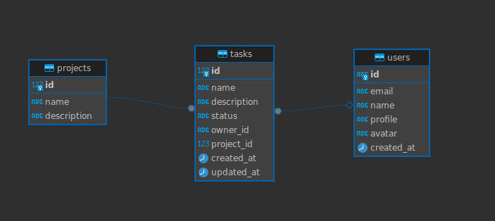

# Gerenciador de Tarefas (API)

Este projeto tem como intuito, aprimorar habilidades em Java, construindo um projeto que faz a gestão de tarefas de usuários baseado em projetos.

### *Principais ferramentas*

**Linguagem Principal:** Java (JDK 21)  
**Framework:** Spring Boot 3 com JPA  
**Banco de Dados:** PostgreSQL  
**Migrações do Banco de Dados:** Flyway  
**Gerenciador de Dependências/Build:** Gradle  

### *Diagrama de Entidade e Relacionamento (DER)*



### *Configuração do Ambiente de Desenvolvimento*

###### JAVA
Baixar e instalar o Java JDK versão 21 [DOWNLOAD](https://www.oracle.com/br/java/technologies/downloads/#java21)  

###### POSTGRESQL

*Opção 1:*
Baixar e instalar o PostgreSQL [DOWNLOAD](https://www.postgresql.org/download/)  

*Opção 2:*
Utilizar o docker para criar um container PostgreSQL local  
```sh
docker run --name gerenciador-tarefas-db -e POSTGRES_USER=gerenciador-tarefas -e POSTGRES_PASSWORD=gerenciador-tarefas -e POSTGRES_DB=gerenciador-tarefas -p 5665:5432 -d postgres
```

###### Variáveis de Ambiente do Projeto
Para executar o projeto, precisaremos de preencher algumas variáveis de ambiente. No projeto existe um arquivo modelo chamado `.env.sample`, nele contém as variáveis que precisam ser preenchidas. Basta duplicar esse arquivo e renomeá-lo para `.env` que o Spring Boot vai procurar os valores e preencher no arquivo `application.properties`. Exemplo de preenchimento:  

```.env
GERENCIADOR_TAREFAS_API_DB_URL=jdbc:postgresql://host:port/db-name
GERENCIADOR_TAREFAS_API_DB_USER=db-user
GERENCIADOR_TAREFAS_API_DB_PWD=db-password
GERENCIADOR_TAREFAS_JPA_SHOW_SQL=true
```

###### Documentação dos Endpoints

A documentação dos endpoints podem ser encontradas no caminho `/swagger-ui/index.html`.  
Caso esteja rodando o projeto local, pode acessar a [DOCUMENTAÇÃO LOCAL](http://localhost:8080/swagger-ui/index.html)
